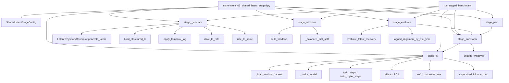

# Reproducible Experiments

This directory contains four controlled experiments. The `.ipynb` files are
the primary, documented entry points. The matching `.py` files provide the
same configurations for terminal execution and automation.

The notebooks do not call the all-in-one experiment runner. They expose the
generative and learning stages as separate cells so that one stage can be
inspected, changed, and rerun without hiding the scientific choices.

> [!important] Current benchmark
> The active experiment is `experiment_05_shared_latent_staged.py`. The four
> experiments listed below are the earlier controlled matrix and remain useful
> as basic examples. The shared-latent benchmark is the one used for the
> two-subject, lagged representation-learning study.

## Shared-latent staged benchmark

### Entry point and execution order

The executable notebook is:

```text
notebooks/experiment_05_shared_latent_staged.py
```

It is intentionally cell-oriented. The cells are run in this order:

| Order | Notebook call | Purpose | Reads | Writes |
|---:|---|---|---|---|
| 1 | `stage_generate(PROJECT_ROOT, CONFIG)` | Generate one common latent process and two spike populations | `SharedLatentStageConfig` | `stage01_data/shared_data.npz`, diagnostics, config |
| 2 | `stage_windows(PROJECT_ROOT, CONFIG)` | Build centered, stride-one, trial-safe windows | stage 1 data | `stage02_windows/windows_A.npz`, `windows_B.npz`, `split.json` |
| 3 | `stage_fit(...)` | Fit PCA, CNN1D, or Transformer for one subject/branch/loss | windows + split | `stage03_models/` |
| 4 | `stage_transform(...)` | Apply the frozen fit to every cached window | windows + fitted model | `stage04_embeddings/` |
| 5 | `stage_evaluate(...)` | Compare embeddings with `M`, `eta`, `Z` and estimate A--B lag | embeddings + latent arrays | `stage05_metrics/` |
| 6 | `stage_plot(...)` | Plot saved embeddings without retraining | embeddings + metadata | `stage06_figures/` |
| 7 | `stage_profile(...)` / `stage_quality_report(...)` | Profile compute and write the separate quality report | frozen artifacts | `stage07_profiles/`, `stage08_quality_report/` |

The batch entry point is `run_staged_benchmark(...)`. It loops over:

```text
branches = ("full_sample", "held_out")
models   = ("pca", "cnn1d", "transformer")
losses   = ("soft", "infonce", "cebra_time", "cebra_behavior")  # ignored for PCA
subjects = ("A", "B")
```

The outer loop is sequential and cache-aware: this prevents simultaneous
models from competing for GPU memory. Neural-network fitting itself uses
PyTorch `DataLoader` mini-batches. PCA is fit on the complete training matrix
for the selected branch, as required by the baseline.

### Protocol and objects

The current default protocol is:

| Object | Shape/value | Meaning |
|---|---|---|
| `Z_shared` | `(200, 200, 3)` | single common latent process |
| `M` | `(200, 200, 3)` | deterministic task geometry |
| `eta` | `(200, 200, 3)` | AR(1) stochastic deviation, with `Z_shared = M + eta` |
| `Z_A` | `(200, 200, 3)` | contemporaneous view of `Z_shared` |
| `Z_B` | `(200, 200, 3)` | delayed view, `lag_bins=10` |
| `X_A` | `(200, 200, 160)` | A spike counts |
| `X_B` | `(200, 200, 120)` | B spike counts |
| `X_windows` | `(n_windows, 21, neurons)` | centered windows, stride 1 |

The frozen staged reference uses a trial-level split of **140 train / 40 test /
20 validation** (70/20/10 globally). The older experiment matrix below still
documents its original 80/20 fit/test examples and is not the split used by
`experiment_05_shared_latent_staged.py`.

The emission calibration is rat-like: `rate_scale=1.0`,
`overdispersion=4.0`, refractory mean `1` bin and standard deviation `0.25`.
The generated diagnostics are approximately 96--97% zero bins, Fano about
1.2, and maximum counts below 10 per bin.

### Module call graph



### Function-level responsibilities

| Function | Defined in | Called by | Calls | When |
|---|---|---|---|---|
| `stage_generate` | `experiments/staged_shared_latent.py` | notebook, `run_staged_benchmark`, `stage_windows` | latent generator, population builder, lag, rate and spike builders | once per config, unless `force=True` |
| `stage_windows` | same | notebook, batch runner, `stage_fit` | `stage_generate`, `build_windows`, trial splitter | after data generation |
| `stage_fit` | same | notebook, batch runner, `stage_transform` | dataset loader, PCA or encoder, `train_steps` / `train_triplet_steps`, selected loss | once per subject/model/loss/branch |
| `stage_transform` | same | notebook, batch runner, evaluator, plotter | `stage_fit`, `encode_windows` or PCA `transform` | after a frozen fit exists |
| `stage_evaluate` | same | notebook, batch runner | `stage_transform`, recovery metrics, lag alignment | after both subject embeddings exist |
| `stage_plot` | same | notebook, batch runner | `stage_transform`, Matplotlib | last; never retrains |
| `run_staged_benchmark` | same | automation/terminal | all stages above | complete factorial benchmark |

### Latent and subject semantics

There is one latent process, not two independent latents:

```text
Z_shared = M + eta
Z_A      = Z_shared
Z_B      = apply_temporal_lag(Z_shared, lag_bins=10)
```

`M` and `eta` are diagnostic components of the same process. The primary
recovery target is `Z_A`/`Z_B` in the appropriate temporal frame. Recovery of
`M` and `eta` is secondary and tells us which part of the signal is captured.

### Evaluation flow

For each subject, the evaluator compares the learned embedding `h` with the
corresponding reference (`Z`, `M`, or `eta`) using:

1. Procrustes (R^2): coordinate agreement after centering and orthogonal
   alignment;
2. RSA Spearman/Pearson: correlation between pairwise geometries;
3. A--B lag alignment: Procrustes score over candidate lags, using trial/time
   keys so windows cannot wrap across trial boundaries.

For large full-sample collections RSA samples a fixed number of pairs instead
of materialising the full quadratic distance matrix. This preserves a
reproducible geometry estimate without exhausting memory.

### Artifact tree

```text
outputs/<run-label>/
├── PARAMETERS.md
├── stage01_data/
│   ├── shared_data.npz
│   ├── config.json
│   └── spike_diagnostics.json
├── stage02_windows/
│   ├── windows_A.npz
│   ├── windows_B.npz
│   └── split.json
├── stage03_models/<branch>/<subject>_<model>_<loss>/
├── stage04_embeddings/<branch>/
├── stage05_metrics/<branch>/
└── stage06_figures/<branch>/
```

The run folder has a short human-readable label (for example
`output_2026-08-26_2111`). `PARAMETERS.md` records every protocol field and the
complete fingerprint, so the exact configuration remains auditable without
putting a long machine-oriented string in the path.

## Experiment Matrix

| Notebook | Task | Known latent coordinates |
|---|---|---|
| `experiment_01_circular_3d.ipynb` | circular reaching | X, Y, progress |
| `experiment_02_circular_5d.ipynb` | circular reaching | X, Y, progress, velocity, context |
| `experiment_03_linear_position_direction.ipynb` | linear track | position, direction |
| `experiment_04_linear_enriched.ipynb` | linear track | position, direction, velocity, context |

All experiments use:

- 160 trials;
- 100 time bins per trial;
- 100 simulated neurons;
- 20 ms bins;
- centered 10-bin windows with stride 1;
- an 80/20 trial-level fit/test split;
- PCA and residual CNN1D encoders;
- 30 CNN training epochs;
- random seed 42.

The controlled matrix changes only the task family and latent-state
dimensionality.

## Running a Notebook

1. Open one `.ipynb` file in VS Code.
2. Select the Python environment in which NeuroBridge is installed.
3. Choose **Run All**, or execute the cells in order.

The notebooks locate the repository automatically when opened from either the
repository root or the `notebooks/` directory.

To run the equivalent scripts:

```bash
python notebooks/experiment_01_circular_3d.py
python notebooks/experiment_02_circular_5d.py
python notebooks/experiment_03_linear_2d.py
python notebooks/experiment_04_linear_4d.py
```

## Pipeline

Each notebook executes the same visible stages:

| Stage | Imported module | Input | Output | Main controls |
|---|---|---|---|---|
| Latent task | `neurobridge.data.sim.LatentTrajectoryGenerator` | experiment config | `Z`, condition, task state | latent dimension, noise, trial count |
| Population map | `neurobridge.data.sim.build_structured_B` or `neurobridge.data.sim.build_linear_loading_and_place_fields` | `Z`/task state | `B`, neuron types, place drive | tuning mixture, place fraction, loading scale |
| Spike emission | `drive_to_rate`, `rate_to_spike` | `Z`, `B`, baseline | `u`, `lam`, `X` | nonlinearity, rate scale, `dt` |
| Windowing | `build_windows_and_labels` | `X`, metadata | `TemporalWindowDataset` | window size, stride, padding |
| Split | `split_trials` | trial metadata | train/test masks | training fraction, seed |
| PCA | `sklearn.decomposition.PCA` | flattened windows | PCA embedding | output dimension |
| Soft target | `build_similarity_matrix` | batch metadata | pairwise target `Q` | time/label weights, target temperature |
| CNN1D | `TemporalCNNEncoder` | temporal windows | CNN embedding | channels, layers, kernel, output dimension |
| Loss | `soft_contrastive_loss` | embedding, `Q` | scalar loss | embedding temperature |
| Evaluation | `evaluate_models` | embeddings, known `Z` | held-out metrics | evaluation subset |
| Saving | `joblib`, `torch.save`, plotting module | all named objects | reproducible artifacts | output directory |

The CNN training loop is also visible. The notebook constructs the
`DataLoader`, model, optimizer, target function, and loss function directly.
`train_steps` and `train_triplet_steps` hide only repeated PyTorch mechanics;
they do not
choose the model, metadata geometry, or objective.

`Z` has shape:

```text
(trials, time bins, latent dimensions)
```

`X` has shape:

```text
(trials, time bins, neurons)
```

Centered padding preserves all 100 time bins, so each model produces 16,000
embedding rows before the train/test selection.

## How to Modify an Experiment

- Change the latent process in the configuration and latent-generation cells.
- Change neural tuning in the population-map cell.
- Change the observation process in the explicit `u`, `lam`, and `X` cell.
- Change temporal context in the configuration, then rerun from windowing.
- Change the target geometry through `time_weight`, `label_weight`, and
  `similarity_tau`, or replace the target function.
- Change the objective by replacing `loss_function`.
- Change the neural architecture in the `TemporalCNNEncoder` constructor.
- Add an encoder by following the visible PCA or CNN path and adding its
  embedding to the evaluation dictionary.

## Circular Task

Every trial begins at a common center and progresses toward one of eight
directions.

The essential state contains X position, Y position, and movement progress.
The enriched state adds velocity and trial context.

## Linear Track

Every trial contains two phases:

```text
outbound: position 0 -> 1, direction +1
return:   position 1 -> 0, direction -1
```

These are phases within each trial, not separate trial classes. A subset of
neurons has Gaussian place fields, so different units preferentially respond
near different track positions.

## Metrics

RSA Spearman correlation compares:

1. all pairwise distances among known states in held-out trials;
2. the corresponding pairwise distances among learned embeddings.

It measures preservation of near/far ordering. It is not classification
accuracy and does not guarantee that a plotted trajectory has the correct
visible shape.

Procrustes R^2 measures coordinate agreement after centering, rotation,
reflection, and global rescaling.

For enriched states, the full metric uses every latent coordinate and the
motor-core metric uses only the task-defining coordinates.

## Reference Results

Single-seed held-out RSA Spearman values:

| Experiment | PCA full | CNN1D full | PCA motor core | CNN1D motor core |
|---|---:|---:|---:|---:|
| Circular 3D | 0.893 | 0.927 | 0.893 | 0.927 |
| Circular 5D | 0.682 | 0.619 | 0.899 | 0.904 |
| Linear position + direction | 0.893 | 0.778 | 0.893 | 0.778 |
| Linear enriched | 0.886 | 0.803 | 0.838 | 0.796 |

These values are reproducibility checks, not final comparative claims. Scalar
metrics must be interpreted together with the saved trajectory figures.

## Generated Artifacts

Each run writes to:

```text
outputs/<experiment-name>/
```

The directory contains:

- `results.joblib`: arrays, metadata, embeddings, split, and metrics;
- `metrics.json`: compact metric summary;
- `models/`: fitted PCA and CNN1D parameters;
- `figures/`: latent, embedding, and task-specific diagnostics.

`outputs/` is intentionally excluded from Git because every artifact can be
regenerated from the notebooks.

## Real-monkey staged branch

The real-data branch is implemented in
`src/neurobridge/experiments/real_monkey.py`, not in the four original
notebooks. Its current run is
`outputs/real_monkey_area2_active_staged_2026-09-22/` and follows:

```text
stage01_data -> stage02_windows -> stage03_models
             -> stage04_embeddings -> stage05_metrics -> stage06_figures
```

It uses 193 Area-2 trials, 21-bin windows over 65 channels, PCA/CNN1D/
Transformer, four objective identifiers, and both raw/unit embeddings. The
held-out branch is the generalization result; `full_sample` is descriptive.
There is no latent `Z` recovery or biological lag claim for this branch.
